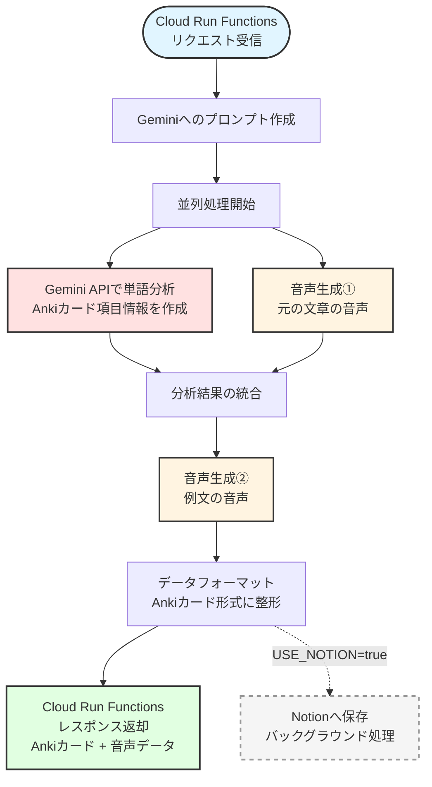

# Anki カードジェネレーター

## 概要
iOSショートカットによって、iPhoneから[Anki](https://apps.ankiweb.net/)カードを自動で生成するツールです。
ショートカットも含めたフローの全体像については、[note]() を参照してください。

### 処理フロー



### 生成される情報
- 意訳・正確な訳、発音記号（IPA）、品詞、英英定義
- 類義語・対義語、例文、覚え方のコツ
- スラング・イディオム・熟語の説明
- IT/マーケティング専門用語、日本での使われ方
- 音声データ（センテンス + 例文）、Obsidianリンク、動画検索リンク
- 頻出度評価（★1〜5）による自動デッキ振り分け
  - ★★★★★ → `Immersion::01-Frequent`
  - ★★★/★★★★ → `Immersion::02-Common`
  - ★/★★ → `Immersion::03-Rare`


---

## 導入方法
### 前提条件

1. **Google Cloudのプロジェクトを作成済み**
   - [Google Cloud](https://cloud.google.com/) から作成

2. **gcloud CLIインストール済み**
   - [Install the gcloud CLI](https://docs.cloud.google.com/sdk/docs/install)

3. **Gemini APIキーを作成済み**
   - [Google AI Studio](https://aistudio.google.com/api-keys)でAPIキーを取得
   - Google CloudのVertex AIを使用する方法もありますが、Google AI Studioであれば無料枠を活用できます

### ローカルテスト

#### 1. 依存関係のインストール
```bash
uv sync
```

#### 2. 環境変数の設定
```bash
export GEMINI_API_KEY=[取得したAPIキー]
export GEMINI_MODEL=gemini-2.0-flash
```

#### 3. ローカルサーバーの起動
```bash
uv run functions-framework --target=main_function --debug
```

#### 4. リクエストのテスト
```bash
curl -X POST http://localhost:8080/ \
  -H "Content-Type: application/json" \
  -d '{
    "sentence": "This is a test sentence.",
    "word": "test",
    "tag": "Other"
  }'
```

### デプロイ手順
依存関係を変更した場合は、`requirements.txt` を更新してください：
```bash
uv export --format requirements-txt > requirements.txt
```
※ このプロジェクトでは `pyproject.toml` + `uv` を使用していますが、Cloud Run のビルドパックは `requirements.txt` のみをサポートしているため。


#### 1. 環境変数の設定
```bash
_GEMINI_API_KEY=[取得したAPIキー]
_GCP_PROJECT_ID=[GoogleCloudのプロジェクトID]
```

#### 2. デプロイコマンドの実行
```bash
gcloud beta run deploy anki-card-generator \
  --source . \
  --function main_function \
  --base-image python312 \
  --region asia-northeast1 \
  --memory 512Mi \
  --timeout 300s \
  --allow-unauthenticated \
  --set-env-vars=GEMINI_API_KEY=$_GEMINI_API_KEY,GCP_PROJECT_ID=$_GCP_PROJECT_ID,GEMINI_MODEL=gemini-2.0-flash
```

#### 3. デプロイ後のサービスURLを取
```bash
gcloud run services describe anki-card-generator --region=asia-northeast1 --format="value(status.url)"
```
→ この取得したURLを iOSショートカットで使用します。


---


## Notionを使用する場合

以下の追加設定をすることで、生成したカード情報をNotionデータベースにも保存することができます。

### 前提条件
1. **Notionインテグレーションの作成**
   - [Notion Integrations](https://www.notion.so/my-integrations) でインテグレーションを作成
   - APIトークンを取得

2. **Notionデータベースの作成と接続**
   - Notionでデータベースを作成
   - データベースにインテグレーションを接続
   - データベースIDを取得（URLの末尾の32文字）

3. **データベースプロパティの設定**

   以下のプロパティ（フィールド）を作成してください：

   | フィールド名 | タイプ | 説明 |
   |-------------|--------|------|
   | Word | Title | 単語（タイトルフィールド） |
   | Sentence | Rich Text | 元の文章 |
   | Tags | Multi-select | タグ |
   | NaturalJapanese | Rich Text | 自然な日本語訳 |
   | Japanese | Rich Text | 正確な日本語訳 |
   | Idioms | Rich Text | イディオム |
   | Slang | Rich Text | スラング |
   | RatingNum | Number | 頻度レーティング（数値） |
   | Rating | Select | 頻度レーティング（星） |
   | Definition | Rich Text | 英語の定義 |
   | JapaneseMeaning | Rich Text | 日本語の意味 |
   | IPA | Rich Text | 発音記号 |
   | PartOfSpeech | Select | 品詞 |
   | ExampleSentence | Rich Text | 例文 |
   | ≈ synonyms | Rich Text | 類義語 |
   | ↔︎ antonyms | Rich Text | 対義語 |
   | Core | Rich Text | 核となる意味 |
   | MemoryAids | Rich Text | 記憶のヒント |
   | JapaneseUsage | Rich Text | 日本語での使用例 |
   | Terminology | Rich Text | 専門用語 |
   | Obsidian | URL | Obsidianリンク |
   | Movie | URL | PlayPhrase.meリンク |
   | AnkiDeck | Rich Text | Ankiデッキ名 |
   | id | Rich Text | ジョブID |

### ローカルテスト（Notion使用時）

環境変数に以下を追加：
```bash
export GEMINI_API_KEY=[取得したAPIキー]
export GEMINI_MODEL=gemini-2.0-flash
export USE_NOTION=true
export NOTION_TOKEN=[取得したNotionトークン]
export NOTION_DB_ID=[NotionデータベースID]
```

### デプロイ（Notion使用時）

#### 1. 環境変数の設定
```bash
_GEMINI_API_KEY=[取得したAPIキー]
_GCP_PROJECT_ID=[GoogleCloudのプロジェクトID]
_USE_NOTION=true
_NOTION_TOKEN=[取得したNotionトークン]
_NOTION_DB_ID=[NotionデータベースID]
```

#### 2. デプロイコマンドの実行
```bash
gcloud beta run deploy anki-card-generator \
  --source . \
  --function main_function \
  --base-image python312 \
  --region asia-northeast1 \
  --memory 512Mi \
  --timeout 300s \
  --allow-unauthenticated \
  --set-env-vars=GEMINI_API_KEY=$_GEMINI_API_KEY,GCP_PROJECT_ID=$_GCP_PROJECT_ID,GEMINI_MODEL=gemini-2.0-flash,USE_NOTION=$_USE_NOTION,NOTION_TOKEN=$_NOTION_TOKEN,NOTION_DB_ID=$_NOTION_DB_ID
```
