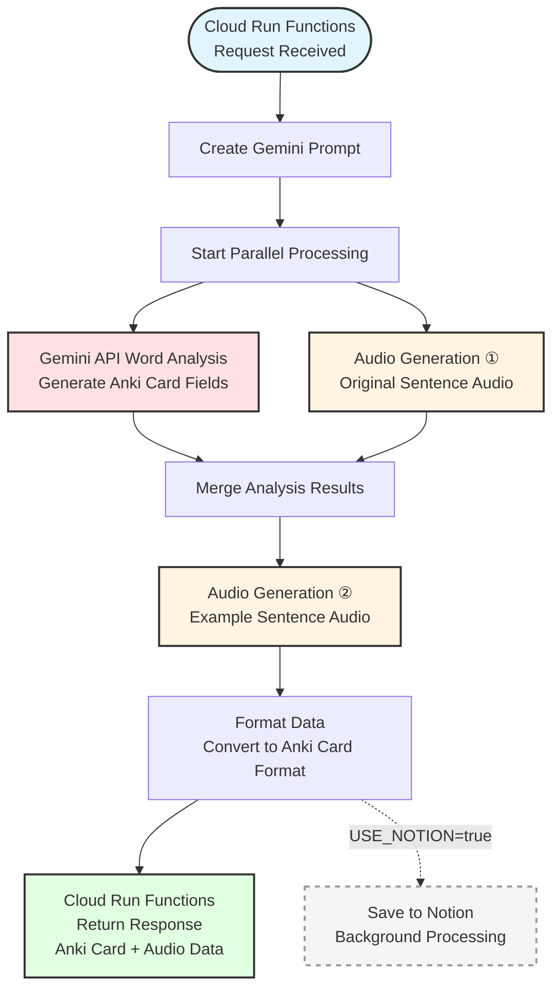

# Anki Card Generator

## Overview
An automated tool for generating [Anki](https://apps.ankiweb.net/) cards from your iPhone using iOS Shortcuts.
For a complete overview of the workflow including shortcuts, refer to [note]().

### Process Flow



### Generated Information
- Contextual and precise translations, IPA pronunciation, part of speech, English definitions
- Synonyms, antonyms, example sentences, memory aids
- Explanations for slang, idioms, and collocations
- IT/Marketing terminology, Japanese usage (katakana English)
- Audio data (sentence + example), Obsidian links, video search links
- Automatic deck sorting based on frequency rating (★1-5)
  - ★★★★★ → `Immersion::01-Frequent`
  - ★★★/★★★★ → `Immersion::02-Common`
  - ★/★★ → `Immersion::03-Rare`

---

## Setup Guide
### Prerequisites

1. **Google Cloud Project Created**
   - Create from [Google Cloud](https://cloud.google.com/)

2. **gcloud CLI Installed**
   - [Install the gcloud CLI](https://docs.cloud.google.com/sdk/docs/install)

3. **Gemini API Key Created**
   - Get your API key from [Google AI Studio](https://aistudio.google.com/api-keys)
   - You can also use Google Cloud's Vertex AI, but Google AI Studio offers a free tier

### Local Testing

#### 1. Install Dependencies
```bash
uv sync
```

#### 2. Set Environment Variables
```bash
export GEMINI_API_KEY=[Your API Key]
export GEMINI_MODEL=gemini-2.0-flash
```

#### 3. Start Local Server
```bash
uv run functions-framework --target=main_function --debug
```

#### 4. Test Request
```bash
curl -X POST http://localhost:8080/ \
  -H "Content-Type: application/json" \
  -d '{
    "sentence": "This is a test sentence.",
    "word": "test",
    "tag": "Other"
  }'
```

### Deployment Steps
If you've changed dependencies, update `requirements.txt`:
```bash
uv export --format requirements-txt > requirements.txt
```
※ This project uses `pyproject.toml` + `uv`, but Cloud Run's buildpack only supports `requirements.txt`.


#### 1. Set Environment Variables
```bash
_GEMINI_API_KEY=[Your API Key]
_GCP_PROJECT_ID=[Your Google Cloud Project ID]
```

#### 2. Run Deploy Command
```bash
gcloud beta run deploy anki-card-generator \
  --source . \
  --function main_function \
  --base-image python312 \
  --region asia-northeast1 \
  --memory 512Mi \
  --timeout 300s \
  --allow-unauthenticated \
  --set-env-vars=GEMINI_API_KEY=$_GEMINI_API_KEY,GCP_PROJECT_ID=$_GCP_PROJECT_ID,GEMINI_MODEL=gemini-2.0-flash
```

#### 3. Get Service URL After Deployment
```bash
gcloud run services describe anki-card-generator --region=asia-northeast1 --format="value(status.url)"
```
→ Use this URL in your iOS Shortcut.


---


## Using Notion (Optional)

You can optionally save generated card information to a Notion database by adding the following settings.

### Prerequisites
1. **Create Notion Integration**
   - Create an integration at [Notion Integrations](https://www.notion.so/my-integrations)
   - Get your API token

2. **Create and Connect Notion Database**
   - Create a database in Notion
   - Connect the integration to the database
   - Get the database ID (last 32 characters of the URL)

3. **Database Property Configuration**

   Create the following properties (fields):

   | Field Name | Type | Description |
   |------------|------|-------------|
   | Word | Title | Word (title field) |
   | Sentence | Rich Text | Original sentence |
   | Tags | Multi-select | Tags |
   | NaturalJapanese | Rich Text | Natural Japanese translation |
   | Japanese | Rich Text | Precise Japanese translation |
   | Idioms | Rich Text | Idioms |
   | Slang | Rich Text | Slang |
   | RatingNum | Number | Frequency rating (number) |
   | Rating | Select | Frequency rating (stars) |
   | Definition | Rich Text | English definition |
   | JapaneseMeaning | Rich Text | Japanese meaning |
   | IPA | Rich Text | IPA pronunciation |
   | PartOfSpeech | Select | Part of speech |
   | ExampleSentence | Rich Text | Example sentence |
   | ≈ synonyms | Rich Text | Synonyms |
   | ↔︎ antonyms | Rich Text | Antonyms |
   | Core | Rich Text | Core meaning |
   | MemoryAids | Rich Text | Memory aids |
   | JapaneseUsage | Rich Text | Japanese usage |
   | Terminology | Rich Text | Terminology |
   | Obsidian | URL | Obsidian link |
   | Movie | URL | PlayPhrase.me link |
   | AnkiDeck | Rich Text | Anki deck name |
   | id | Rich Text | Job ID |

### Local Testing (With Notion)

Add the following to environment variables:
```bash
export GEMINI_API_KEY=[Your API Key]
export GEMINI_MODEL=gemini-2.0-flash
export USE_NOTION=true
export NOTION_TOKEN=[Your Notion Token]
export NOTION_DB_ID=[Your Notion Database ID]
```

### Deployment (With Notion)

#### 1. Set Environment Variables
```bash
_GEMINI_API_KEY=[Your API Key]
_GCP_PROJECT_ID=[Your Google Cloud Project ID]
_USE_NOTION=true
_NOTION_TOKEN=[Your Notion Token]
_NOTION_DB_ID=[Your Notion Database ID]
```

#### 2. Run Deploy Command
```bash
gcloud beta run deploy anki-card-generator \
  --source . \
  --function main_function \
  --base-image python312 \
  --region asia-northeast1 \
  --memory 512Mi \
  --timeout 300s \
  --allow-unauthenticated \
  --set-env-vars=GEMINI_API_KEY=$_GEMINI_API_KEY,GCP_PROJECT_ID=$_GCP_PROJECT_ID,GEMINI_MODEL=gemini-2.0-flash,USE_NOTION=$_USE_NOTION,NOTION_TOKEN=$_NOTION_TOKEN,NOTION_DB_ID=$_NOTION_DB_ID
```
